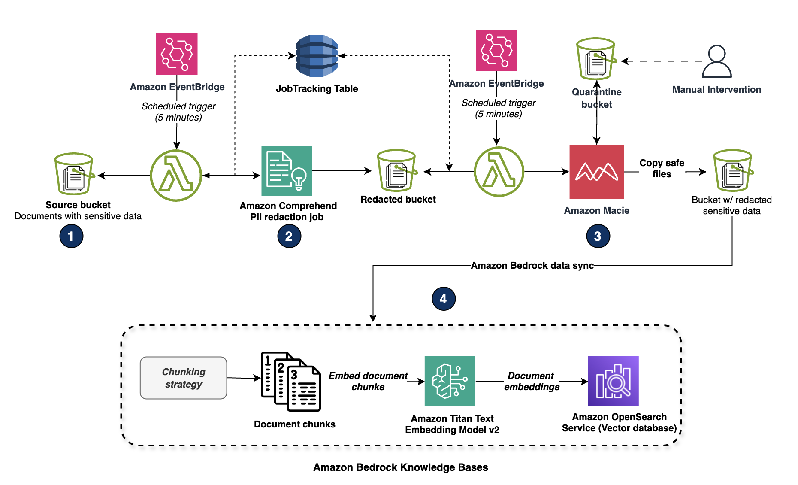
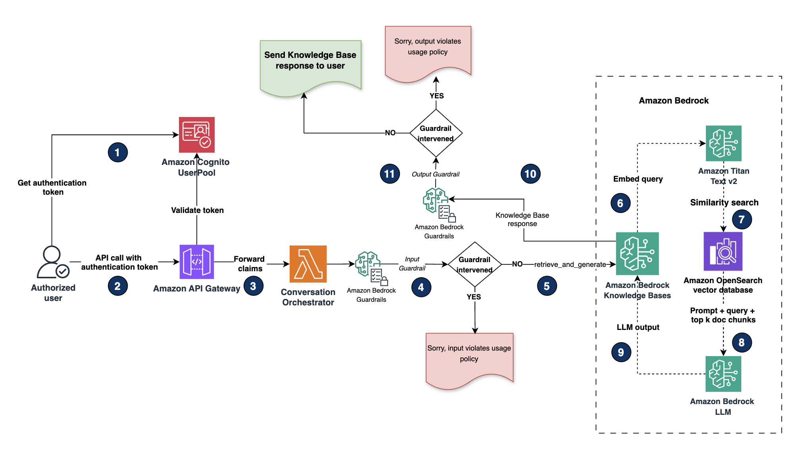

# Secure RAG Applications with Amazon Bedrock — PII Protection & Role-Based Guardrails

> **Infrastructure as Code** — Production-ready Terraform implementation of two complementary security patterns for RAG (Retrieval Augmented Generation) applications on AWS, protecting sensitive data (PII/PHI) throughout the entire pipeline.

---

## Overview

As organisations increasingly adopt RAG-based applications to enhance generative AI with contextual knowledge, securing sensitive data across the pipeline becomes critical. This repository implements two defence-in-depth patterns that work together to protect Personally Identifiable Information (PII), Protected Health Information (PHI), and confidential business data.

| Pattern | Folder | Core Principle |
|---|---|---|
| **Scenario 1** — PII Redaction at Ingestion | `scenario_1/` | Sanitise data *before* it enters the vector store — zero trust at the source |
| **Scenario 2** — Role-Based Access Control | `scenario_2/` | Control *who sees what* at retrieval time based on user role |

> These two patterns are **complementary, not mutually exclusive.** In a production environment, you would deploy both: Scenario 1 ensures clean data at rest, whilst Scenario 2 enforces access control at query time.

---

## How the Two Scenarios Complement Each Other
```
┌─────────────────────────────────────────────────────────────────┐
│                        DOCUMENT LIFECYCLE                        │
│                                                                   │
│  RAW DOCUMENT                                                     │
│      │                                                            │
│      ▼                                                            │
│  ┌─────────────────────────────────────┐                         │
│  │         SCENARIO 1 — INGESTION      │                         │
│  │                                     │                         │
│  │  S3 (inputs) → Comprehend (redact)  │                         │
│  │      → Macie (verify) → S3 (clean)  │                         │
│  │      → Bedrock Knowledge Base       │                         │
│  └─────────────────────────────────────┘                         │
│      │                                                            │
│      │  Clean, redacted embeddings in vector store               │
│      ▼                                                            │
│  ┌─────────────────────────────────────┐                         │
│  │         SCENARIO 2 — RETRIEVAL      │                         │
│  │                                     │                         │
│  │  Cognito (auth) → API Gateway       │                         │
│  │      → Lambda (role check)          │                         │
│  │      → Admin guardrail (full access)│                         │
│  │      → Non-admin guardrail (masked) │                         │
│  └─────────────────────────────────────┘                         │
│      │                                                            │
│      ▼                                                            │
│  RESPONSE (role-appropriate, policy-compliant)                    │
└─────────────────────────────────────────────────────────────────┘
```

Scenario 1 acts as the **first line of defence** — ensuring that even if access controls fail, sensitive data has already been redacted before storage. Scenario 2 acts as the **second line of defence** — dynamically enforcing role-based access policies at query time, masking any residual sensitive information based on the user's permissions.

---

## Scenario 1 — PII Redaction at Ingestion

### Architecture



### Process Flow

**Ingestion Pipeline:**

1. Documents containing sensitive data are uploaded to the `inputs/` folder in the source S3 bucket
2. An **Amazon EventBridge** rule triggers the `ComprehendLambda` function every 5 minutes
3. Lambda moves files to a `processing/` folder and launches an asynchronous **Amazon Comprehend** PII redaction job, recording the job ID in **Amazon DynamoDB** for tracking
4. Comprehend identifies and replaces PII entities with typed placeholders — `[NAME]`, `[SSN]`, `[EMAIL]`, `[ADDRESS]` — preserving document structure whilst removing sensitive values
5. Redacted files move to a `for_macie_scan/` folder where **Amazon Macie** performs a secondary verification pass
6. Files with high severity findings are moved to a `quarantine/` bucket for manual review; clean files proceed to the `redacted/` bucket
7. Redacted documents are ingested into the **Amazon Bedrock Knowledge Base**, ensuring the vector store contains only sanitised content

**Retrieval Pipeline:**

1. Authenticated users query via **Amazon Cognito** → **API Gateway** → **Lambda**
2. Input guardrails validate the user query against content policies
3. **Amazon Bedrock Knowledge Bases** embeds the query using **Amazon Titan Text v2** and performs similarity search against the OpenSearch vector store
4. The augmented prompt is sent to the **Amazon Bedrock LLM** for inference
5. Output guardrails perform a final policy check before returning the response

### AWS Services — Scenario 1

| Service | Role |
|---|---|
| Amazon S3 | Document storage (inputs, processing, redacted, quarantine) |
| Amazon Comprehend | Async PII detection and redaction |
| Amazon Macie | Secondary sensitive data verification |
| AWS Lambda | Pipeline orchestration and job tracking |
| Amazon DynamoDB | Comprehend job status tracking |
| Amazon EventBridge | Scheduled pipeline trigger (every 5 minutes) |
| Amazon Bedrock Knowledge Bases | Vector store ingestion and RAG retrieval |
| Amazon OpenSearch Serverless | Embedding vector store |
| Amazon Cognito | User authentication |
| Amazon API Gateway | REST API endpoint |
| Amazon Bedrock Guardrails | Input/output content policy enforcement |

---

## Scenario 2 — Role-Based Access Control (RBAC)

### Architecture



### Process Flow

1. The user authenticates via **Amazon Cognito** user pool, receiving a JWT token containing group membership claims (`admin` or `non-admin`)
2. The user submits a query via REST API call to **Amazon API Gateway**, passing the JWT token in the request header
3. API Gateway forwards the payload and claims to the **Lambda Conversation Orchestrator**
4. Lambda extracts the Cognito group claims from the JWT and determines the user's role
5. Based on the role, Lambda selects the appropriate **Amazon Bedrock Guardrail**:
   - **Admin** → `admin-guardrail`: full data access, content policy only, no PII masking
   - **Non-admin** → `non-admin-guardrail`: metadata-filtered retrieval, PII entities anonymised in output
6. **Amazon Bedrock Knowledge Bases** embeds the query using **Amazon Titan Text v2**
7. Similarity search is performed against the **Amazon OpenSearch Serverless** vector store; non-admin queries include metadata filters to restrict document access
8. The augmented prompt is sent to the **Amazon Bedrock LLM** for inference
9. The LLM output is evaluated against the role-appropriate guardrail policies
10. Admin users receive the full response with no masking; non-admin users receive the response with PII entities anonymised (e.g., names, emails, phone numbers, SSNs replaced with `[NAME]`, `[EMAIL]`, etc.)

### AWS Services — Scenario 2

| Service | Role |
|---|---|
| Amazon Cognito | Authentication and role-based group membership |
| Amazon API Gateway | REST API with Cognito authoriser |
| AWS Lambda | RBAC orchestration — role extraction and guardrail selection |
| Amazon Bedrock Guardrails | Admin guardrail (no masking) and non-admin guardrail (PII anonymisation) |
| Amazon Bedrock Knowledge Bases | RAG retrieval with optional metadata filtering |
| Amazon OpenSearch Serverless | Embedding vector store with role-based metadata |
| Amazon Titan Text v2 | Query embedding model |
| Amazon Bedrock LLM | Response generation (Claude 3) |
| AWS KMS | Encryption at rest |
| AWS IAM | Least-privilege roles and policies |

---

## Repository Structure
```
.
├── scenario_1/                        # PII Redaction at Ingestion
│   ├── main.tf
│   ├── variables.tf
│   ├── outputs.tf
│   └── modules/
│       ├── s3/                        # Source, processing, redacted, quarantine buckets
│       ├── lambda/                    # Comprehend trigger and Macie monitor
│       ├── dynamodb/                  # Job tracking table
│       └── eventbridge/               # Scheduled pipeline trigger
│
├── scenario_2/                        # Role-Based Access Control
│   ├── main.tf
│   ├── variables.tf
│   ├── outputs.tf
│   └── modules/
│       ├── cognito/                   # User pool and admin/non-admin groups
│       ├── api_gateway/               # REST API with Cognito authoriser
│       ├── lambda/                    # RBAC orchestrator
│       ├── bedrock_kb/                # Knowledge Base and data source
│       ├── opensearch/                # Serverless vector store
│       ├── guardrails/                # Admin and non-admin guardrails
│       └── kms/                       # Encryption key
│
└── docs/
    ├── scenario1-architecture.png
    └── scenario2-architecture.png
```

---

## Prerequisites

- Terraform >= 1.5
- AWS CLI configured (`aws configure`)
- AWS account with Amazon Bedrock model access enabled (Claude 3 Sonnet / Titan Text v2)
- Python 3.11+ (for Lambda packaging)

---

## Quick Start

### Deploy Scenario 1 — PII Redaction
```bash
cd scenario_1
cp terraform.tfvars.example terraform.tfvars
# Edit terraform.tfvars with your values
terraform init
terraform plan
terraform apply
```

### Deploy Scenario 2 — Role-Based Access Control
```bash
cd scenario_2
cp terraform.tfvars.example terraform.tfvars
# Edit terraform.tfvars with your values
terraform init
terraform plan
terraform apply
```

---

## Security Considerations

- All S3 buckets enforce server-side encryption and block public access
- Cognito JWT tokens are validated at API Gateway before Lambda invocation
- IAM roles follow least-privilege principles throughout
- Amazon Macie provides continuous sensitive data detection and alerting
- Bedrock Guardrails enforce responsible AI policies on both input and output
- KMS encryption is applied to all data at rest

> This solution follows the [AWS Shared Responsibility Model](https://aws.amazon.com/compliance/shared-responsibility-model/). You are responsible for configuring PII detection types and guardrail policies appropriate to your compliance requirements (HIPAA, GDPR, etc.).

---

## References

- [Amazon Bedrock Guardrails Documentation](https://docs.aws.amazon.com/bedrock/latest/userguide/guardrails.html)
- [Amazon Bedrock Knowledge Bases](https://docs.aws.amazon.com/bedrock/latest/userguide/knowledge-base.html)
- [OWASP Top 10 for LLM Applications](https://owasp.org/www-project-top-10-for-large-language-model-applications/)
- [AWS Shared Responsibility Model](https://aws.amazon.com/compliance/shared-responsibility-model/)

---

## Licence

MIT Licence
